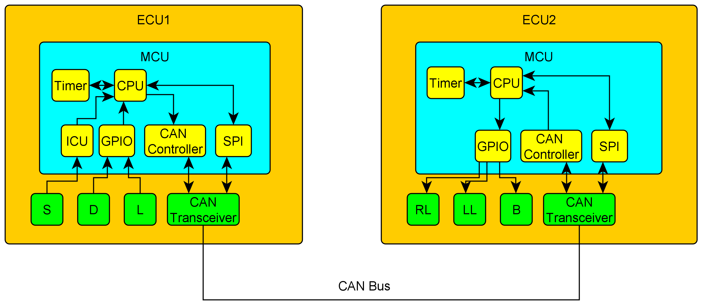
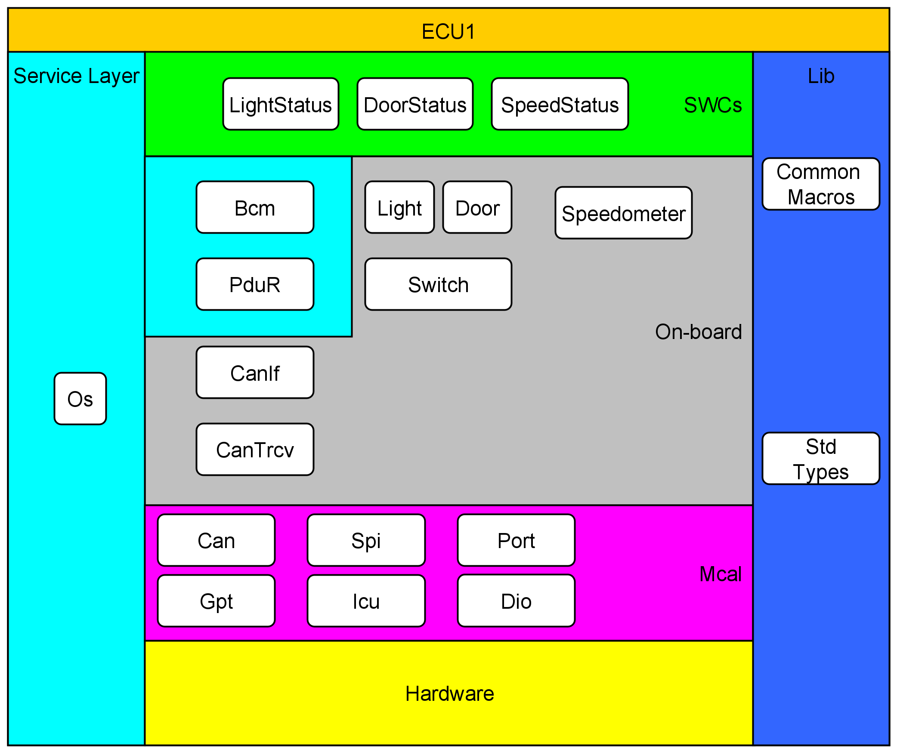
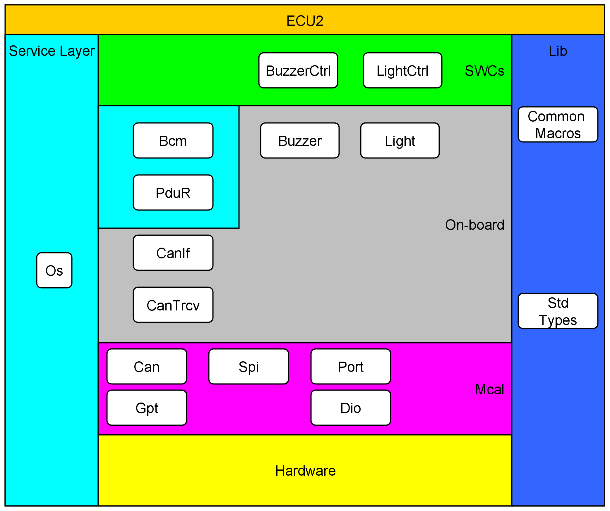
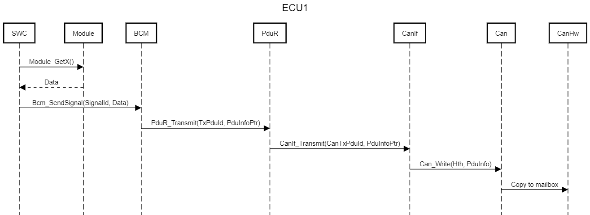
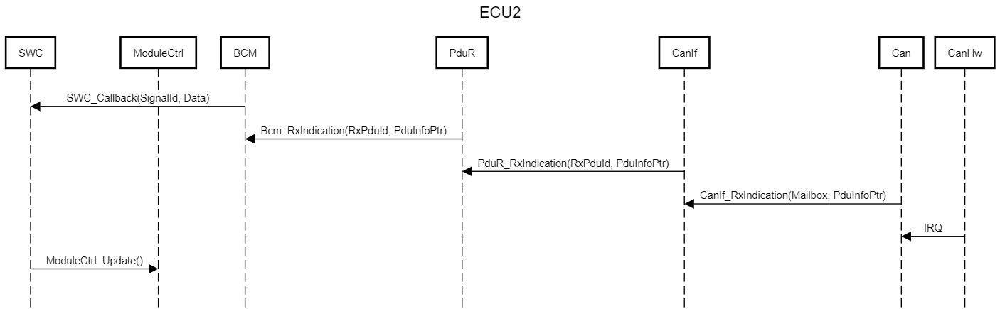
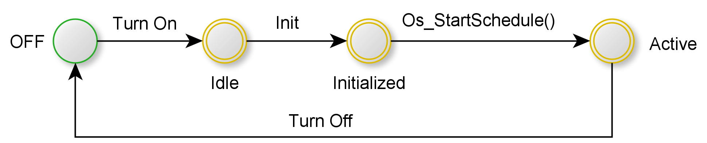
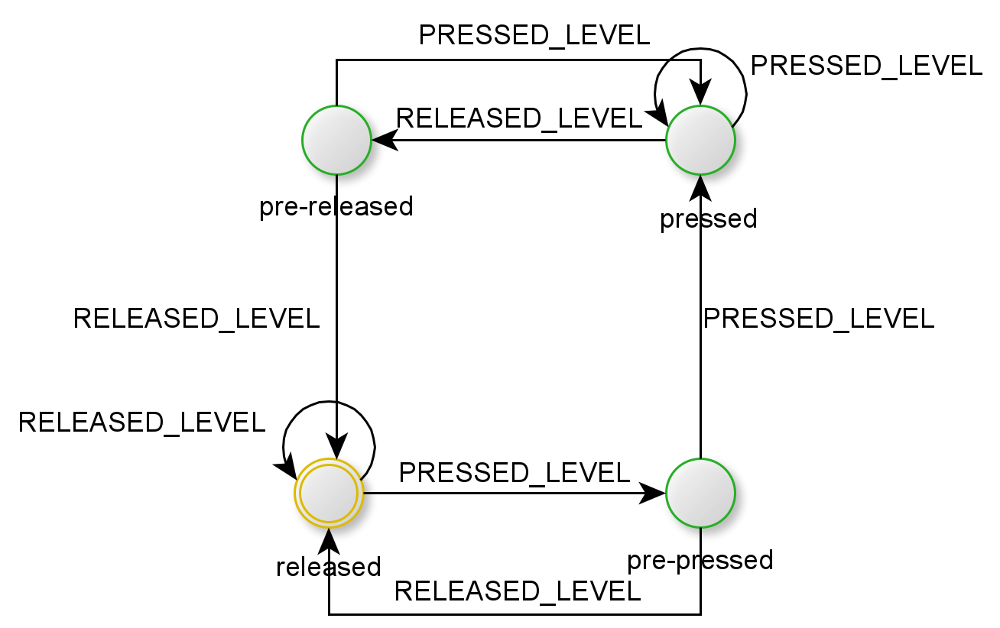
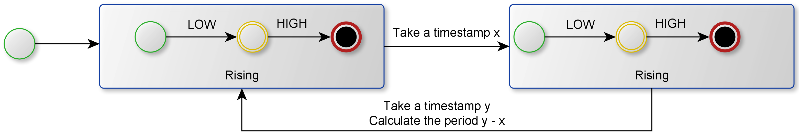

# About

This repository contains a design for an automotive door control system. It contains both
static and dynamic design.

# Block Diagram

# Static Design

## ECU 1

## ECU 2

# Dynamic Design

## Sequence Diagrams

### ECU1

### ECU 2

## State Machines

### Ecu 

### Switch 

### Speedometer

